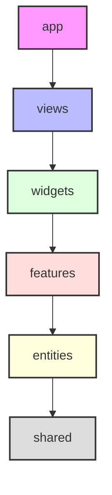

# 🌊 Flare — Веб-сервис по продаже цифровых товаров

Дипломный проект по разработке современной e-commerce платформы для дистрибуции цифровых товаров (игр, игровых подписок, внутриигровой валюты, донатов и сопутствующих услуг), разработанный специально по заказу **ООО «Студия Олега Чулакова»**.

---

## 📌 Описание проекта

**Flare** — это масштабируемый веб-сервис с высокой производительностью, ориентированный на геймеров и любителей цифрового контента. Проект предоставляет пользователям возможность беспрепятственно приобретать ключи активации, оформлять подписки, пополнять балансы игровых платформ (таких как Steam, PlayStation Store, Xbox Live) и совершать донаты напрямую.

### Ключевой функционал:
*   **Каталог цифровых товаров:** Игры (Steam, Epic Games, GOG), подписки (PS Plus, Xbox Game Pass, Spotify) и внутриигровая валюта с фильтрацией по лаунчерам и жанрам.
*   **Личный кабинет и кошелек:** Просмотр истории заказов, управление балансом и купленными товарами.
*   **Интеграция платежной системы:** Безопасные онлайн-платежи через сервис Stripe с поддержкой подписок и мгновенным подтверждением через вебхуки.
*   **Авторизация и безопасность:** Гибкая система аутентификации с использованием NextAuth и Supabase.
*   **Панель администратора:** Полнофункциональный интерфейс для управления товарами, заказами, промокодами и пользователями.

---

## 🛠 Технологический стек

Проект реализован с использованием передовых технологий веб-разработки:

[](https://nextjs.org/)
[](https://reactjs.org/)
[](https://www.typescriptlang.org/)
[](https://www.prisma.io/)
[](https://www.postgresql.org/)
[](https://supabase.com/)
[](https://tailwindcss.com/)
[](https://react-hook-form.com/)
[](https://tanstack.com/query)
[](https://next-auth.js.org/)
[](https://zod.dev/)
[](https://stripe.com/)

---

## 📐 Архитектура: Feature-Sliced Design (FSD)

Проект спроектирован по методологии **Feature-Sliced Design**, что гарантирует строгую иерархию зависимостей, изоляцию модулей и масштабируемость кодовой базы.



### Разделение по слоям в структуре `src/`:

1.  **`app/`** — инициализация приложения, глобальные стили, сервис-провайдеры (QueryClientProvider, NextAuthProvider) и корневые роуты Next.js.
2.  **`views/`** — страницы приложения. Представляют собой композицию виджетов.
    *   *Примеры:* `home`, `games`, `subscriptions`, `profile`, `wallets`, `admin`, `steam-topup`, `faq`.
3.  **`widgets/`** — крупные самостоятельные блоки страниц (шапка, подвал, сайдбары).
    *   *Примеры:* `Header`, `Footer`, `NavigationBar`, `AdminHeader`, `AdminSidebar`.
4.  **`features/`** — интерактивные пользовательские действия, приносящие бизнес-ценность.
    *   *Примеры:* `auth` (регистрация и авторизация), `Payment` (оплата заказа), `Search` (поиск товаров).
5.  **`entities/`** — бизнес-сущности и модели данных. Содержат базовые компоненты UI, типы данных и методы API для работы с сущностью.
    *   *Примеры:* `game`, `product`, `order`, `user`, `wallet`, `promocode`, `service`, `admin`.
6.  **`shared/`** — переиспользуемый инфраструктурный код без привязки к бизнес-логике.
    *   *Содержимое:* Компоненты пользовательского интерфейса (кнопки, инпуты, модалки), общие хелперы, типы данных (`type-guards`), API-клиенты.

*Примечание: Импорты строго подчиняются правилу восходящего направления (модуль может импортировать только то, что находится ниже по списку).*

---

## 🚀 Быстрый старт

Для запуска проекта локально выполните следующие шаги:

### 1. Клонирование репозитория
```bash
git clone <URL_ВАШЕГО_РЕПОЗИТОРИЯ>
cd flare
```

### 2. Установка зависимостей
Проект поддерживает работу с менеджерами пакетов `npm` и `bun`. Для установки введите:
```bash
npm install
# или с использованием bun (рекомендуется)
bun install
```

### 3. Настройка переменных окружения
Создайте файл `.env` в корневом каталоге проекта на основе шаблона и заполните необходимые ключи:
```bash
cp .env.example .env
```

Подробное описание параметров конфигурации приведено в разделе **Переменные окружения**.

### 4. Генерация Prisma-клиента и применение миграций БД
Сгенерируйте клиент Prisma и примените схему базы данных PostgreSQL:
```bash
npx prisma generate
npx prisma db push
```

### 5. Запуск сервера разработки
```bash
npm run dev
# или с использованием bun
bun dev
```

Приложение будет доступно по адресу: [http://localhost:3000](http://localhost:3000).

---

## 🔑 Переменные окружения (`.env`)

Для корректной работы всех модулей платформы (базы данных, аутентификации и платежей) требуется настроить следующие ключи в файле `.env`:

### База данных (PostgreSQL / Prisma)
*   `DATABASE_URL`: Строка подключения к PostgreSQL с поддержкой пула соединений (Connection Pooling). Необходима для работы приложения в режиме реального времени.
*   `DIRECT_URL`: Прямая строка подключения к базе данных PostgreSQL (в обход пула). Необходима Prisma для выполнения миграций.

### Интеграция Supabase
*   `NEXT_PUBLIC_SUPABASE_URL`: Публичный URL-адрес вашего проекта Supabase.
*   `NEXT_PUBLIC_SUPABASE_ANON_KEY`: Публичный анонимный API-ключ для инициализации клиента Supabase на стороне фронтенда.
*   `SUPABASE_SERVICE_ROLE_KEY`: Сервисный секретный ключ (Service Role API key) для бэкенда, позволяющий обходить политики RLS (Row Level Security) при административных действиях.

### Аутентификация (NextAuth)
*   `NEXTAUTH_URL`: Канонический базовый URL приложения (для локальной разработки: `http://localhost:3000`).
*   `NEXTAUTH_SECRET`: Секретная случайная строка, используемая NextAuth для шифрования JWT-токенов и сессий пользователей.

### Интеграция Stripe
*   `STRIPE_SECRET_KEY`: Приватный ключ API Stripe для выполнения запросов создания платежных сессий с сервера.
*   `NEXT_PUBLIC_STRIPE_PUBLISHABLE_KEY`: Публичный ключ Stripe для рендеринга платежной формы на клиенте.
*   `STRIPE_WEBHOOK_SECRET`: Секрет подписи вебхуков Stripe для безопасной проверки статуса прохождения платежей.

---

## 🧪 Тестирование и проверка кода

В проекте настроена среда тестирования с использованием Jest:

*   **Запуск тестов:** `npm run test` (или `bun test`)
*   **Запуск тестов в режиме отслеживания изменений:** `npm run test:watch`
*   **Генерация отчета о покрытии тестами:** `npm run test:coverage`
*   **Проверка кода линтером:** `npm run lint`
